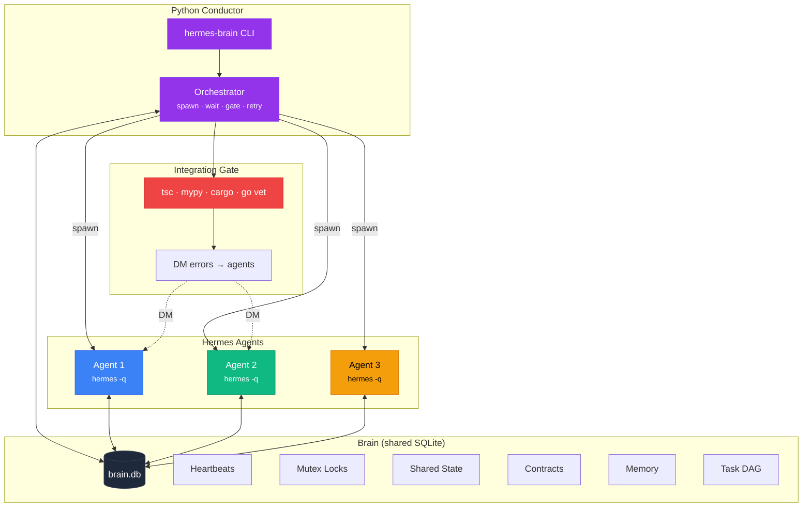
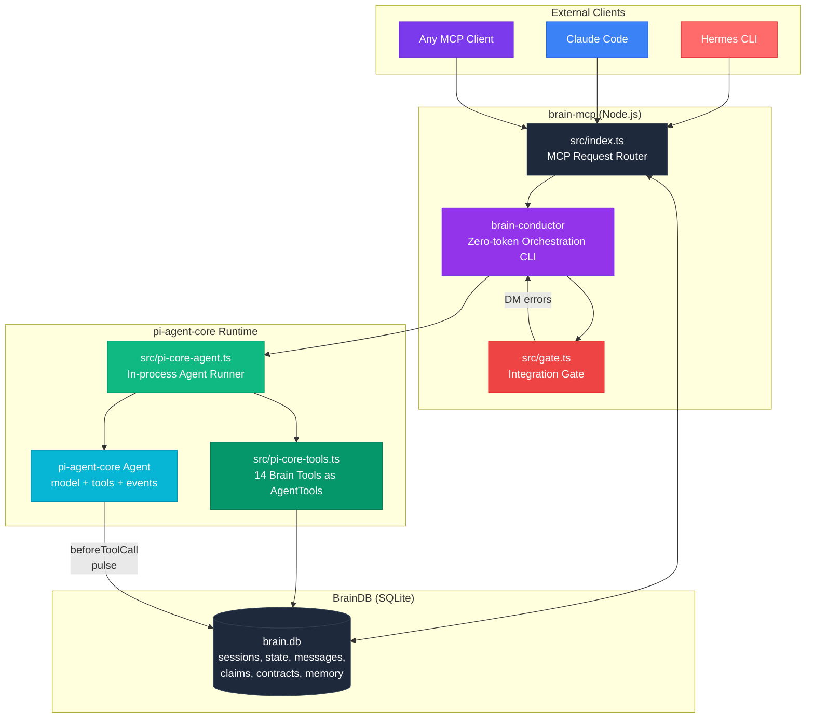
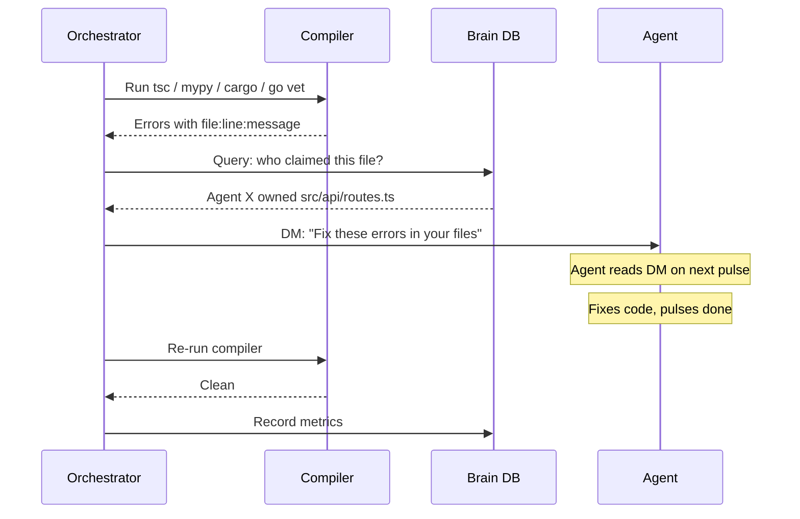
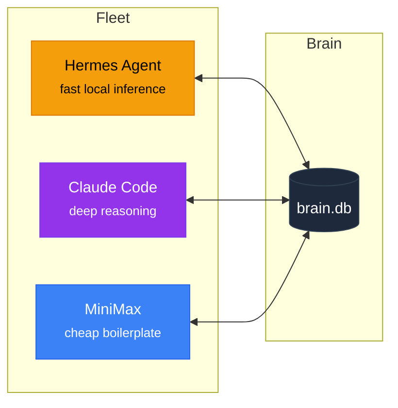
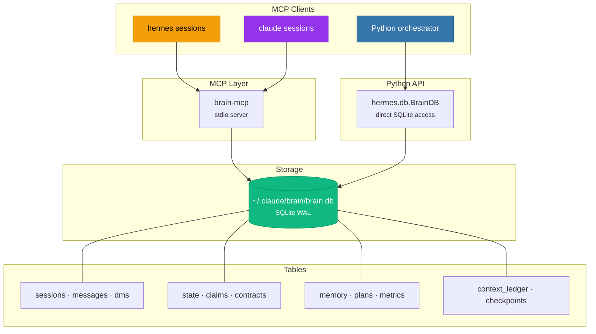
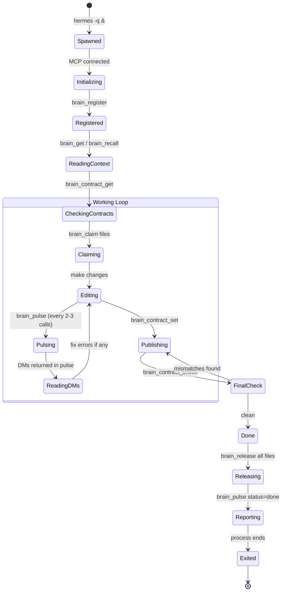
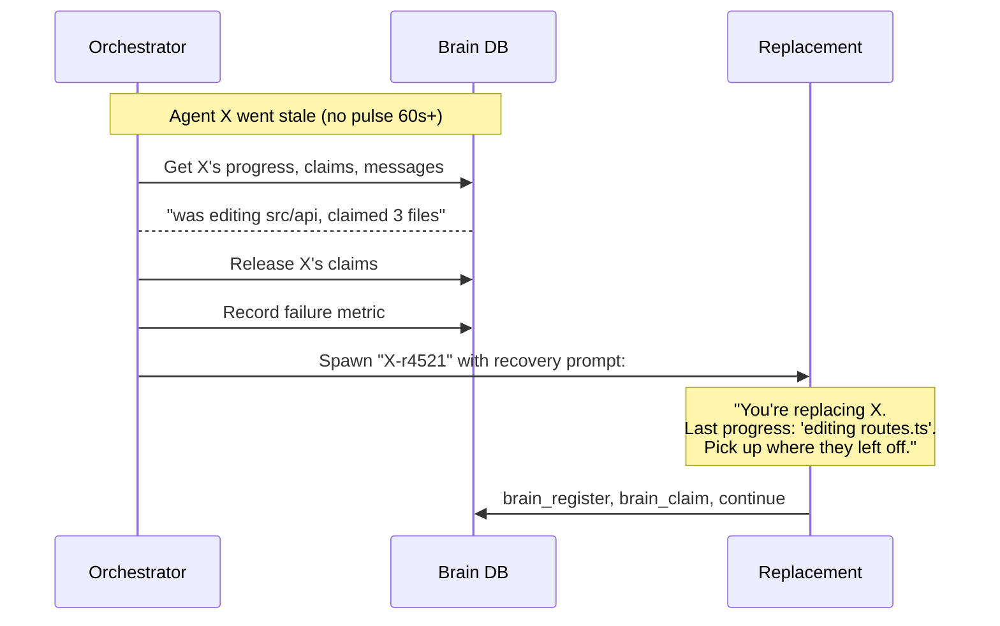
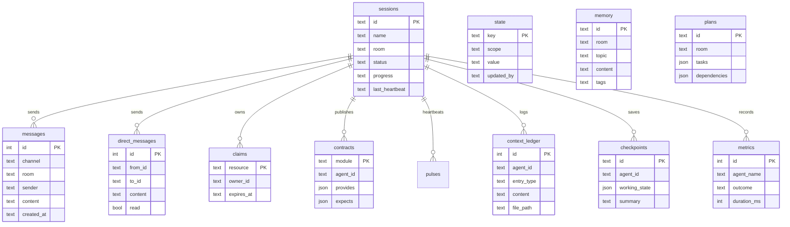
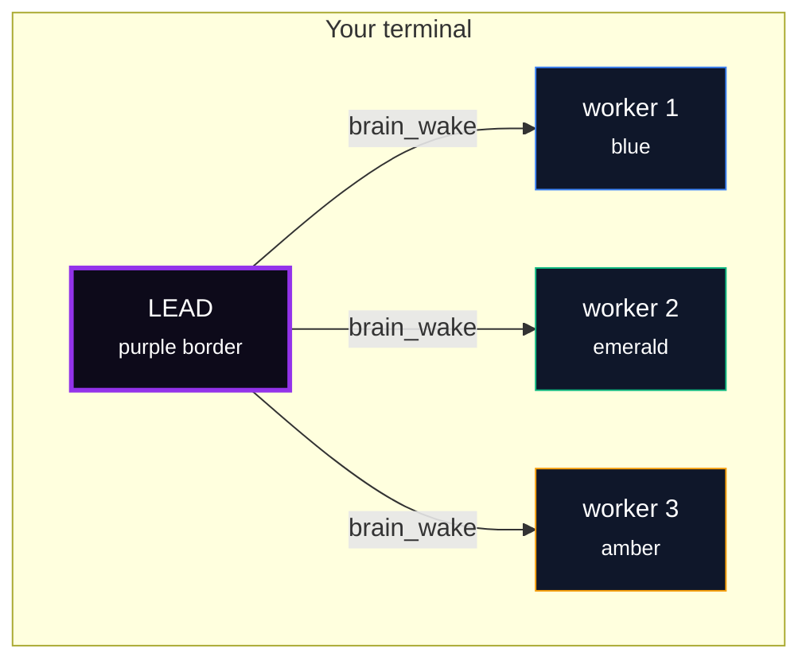

<div align="center">

<br>

# Hermes Brain

**Multi-agent orchestration for [Hermes Agent](https://github.com/NousResearch/hermes-agent)**

Spawn parallel Hermes agents. Give them a shared brain. Ship in one command.<br>Backed by SQLite, coordinated by Python, zero tokens spent on coordination.

<br>

[](LICENSE)
[](https://python.org)
[](https://nodejs.org)
[](https://github.com/NousResearch/hermes-agent)
[](https://modelcontextprotocol.io)

<br>

[Install](#install) · [Quick Start](#quick-start) · [How It Works](#how-it-works) · [CLI](#the-hermes-brain-cli) · [Tools](#brain-tools) · [Memory Bank](#memory-bank-persistent-context) · [Development](#development)

<br>

</div>

---

## Install

**Option 1 — npm (fastest)**
```bash
npm install -g @hermes/brain-mcp
```

Then register with Hermes:
```bash
hermes mcp add brain -s user -- brain-mcp
```

**Option 2 — from source**
```bash
curl -fsSL https://raw.githubusercontent.com/DevvGwardo/brain-mcp/main/install.sh | bash
```

The installer:
1. Builds the Node.js MCP server (`brain-mcp`)
2. Installs the Python orchestration package (`hermes-brain`)
3. Registers the brain as an MCP server in Hermes and Claude Code

**Verify:**
```bash
hermes mcp list | grep brain
hermes-brain --help
```

**Prerequisites:** Python 3.10+, Node.js 18+, [Hermes Agent](https://github.com/NousResearch/hermes-agent), [Claude Code](https://docs.claude.com/claude-code/getting-started.html)

**Sharing with friends?** Each person's brain is its own isolated SQLite DB — no network config needed. Same one-liner works anywhere.

**Docker users:** Spawn agents with `layout: "headless"` since tmux panes can't render in a headless container:
```python
brain_wake({ task: "...", layout: "headless" })
```

---

## Quick Start

**One command to orchestrate a fleet of Hermes agents:**

```bash
hermes-brain "Build a REST API with auth, users, and posts" \
  --agents api-routes auth-layer db-models tests
```

What happens:
1. Python conductor spawns 4 background Hermes agents (`hermes -q`)
2. Each agent claims its files, publishes contracts, writes code, pulses heartbeats
3. Conductor runs an **integration gate** — compiles the project, routes errors back to responsible agents via DM
4. Agents self-correct. Gate retries until clean.
5. Summary printed: agents, contracts, memories, metrics, done.

**More ways to run it:**

```bash
# Auto-named agents
hermes-brain "Add error handling to the whole codebase"

# Mix models per task
hermes-brain "Build a game" --agents engine ui store --model claude-sonnet-4-5

# Cheap model for boilerplate
hermes-brain "Generate 10 test files" --model claude-haiku-4-5

# JSON pipeline with multiple phases
hermes-brain --config pipeline.json
```

**Or from inside Hermes (interactive):**

```
hermes> Use brain:brain_register, then brain:brain_wake to spawn 3 agents
        that each refactor a different module.
```

---

## How It Works



### Architecture

This diagram shows the internal architecture of brain-mcp and how its components interact:



**pi-agent-core** is the LLM agent runtime — handles the model interaction loop, tool execution, and event subscription. **brain-mcp** provides the coordination layer (state, messaging, heartbeats, locks, contracts) as tools that pi agents call. The **conductor** ties it all together with phases, gates, and tmux layout.

**Zero-token coordination.** The conductor is pure Python — LLM tokens are only spent on the actual work. Heartbeats, claims, contracts, gates, retries all run locally.

**No server to manage.** Each agent opens its own stdio connection to the brain. SQLite WAL mode handles concurrent access safely.

**Same brain, any CLI.** Hermes, Claude Code, MiniMax — all clients hit the same SQLite DB. A mixed fleet of Hermes + Claude agents can coordinate on the same task.

---

## The `hermes-brain` CLI

```bash
hermes-brain <task> [options]
```

| Flag | Default | What it does |
|:-----|:--------|:-------------|
| `--agents <names...>` | `agent-1 agent-2` | Agent names to spawn in parallel |
| `--model <id>` | `claude-sonnet-4-5` | Model passed to each agent |
| `--no-gate` | off | Skip integration gate |
| `--retries <n>` | `3` | Max gate retry attempts |
| `--timeout <seconds>` | `600` | Per-agent timeout |
| `--config <file.json>` | | Load a multi-phase pipeline |
| `--db-path <path>` | `~/.claude/brain/brain.db` | Custom brain DB |

### Pipeline config file

```json
{
  "task": "Build a todo app",
  "model": "claude-sonnet-4-5",
  "gate": true,
  "max_gate_retries": 3,
  "phases": [
    {
      "name": "foundation",
      "parallel": true,
      "agents": [
        { "name": "types",  "files": ["src/types/"], "task": "Define all TS types" },
        { "name": "db",     "files": ["src/db/"],    "task": "Set up Prisma schema" }
      ]
    },
    {
      "name": "feature",
      "parallel": true,
      "agents": [
        { "name": "api",    "files": ["src/api/"],   "task": "REST endpoints" },
        { "name": "ui",     "files": ["src/ui/"],    "task": "React components" }
      ]
    },
    {
      "name": "quality",
      "parallel": true,
      "agents": [
        { "name": "tests",  "task": "Write unit + integration tests" }
      ]
    }
  ]
}
```

Phases run sequentially. Agents within a phase run in parallel. The integration gate runs between phases.

---

## Brain Tools

**35+ tools across 12 categories.** All available to Hermes, Claude Code, and any MCP-compatible agent.

### Identity & Health

| Tool | What it does |
|:-----|:-------------|
| `brain_register` | Name this session |
| `brain_sessions` | List active sessions |
| `brain_status` | Show session info + room |
| `brain_pulse` | Heartbeat with status + progress (returns pending DMs) |
| `brain_agents` | Live health of all agents (status, heartbeat age, claims) |

### Messaging

| Tool | What it does |
|:-----|:-------------|
| `brain_post` | Post to a channel |
| `brain_read` | Read from a channel |
| `brain_dm` | Direct message another agent |
| `brain_inbox` | Read your DMs |

### Shared State & Memory

| Tool | What it does |
|:-----|:-------------|
| `brain_set` / `brain_get` | Ephemeral key-value store |
| `brain_keys` / `brain_delete` | List / remove keys |
| `brain_remember` | Store persistent knowledge (survives `brain_clear`) |
| `brain_recall` | Search memories from previous sessions |
| `brain_forget` | Remove outdated memories |

### File Locking

| Tool | What it does |
|:-----|:-------------|
| `brain_claim` | Lock a file/resource (TTL-based mutex) |
| `brain_release` | Unlock |
| `brain_claims` | List active locks |

### Contracts (prevents integration bugs)

| Tool | What it does |
|:-----|:-------------|
| `brain_contract_set` | Publish what your module provides / expects |
| `brain_contract_get` | Read other agents' contracts before coding |
| `brain_contract_check` | Validate all contracts — catches param mismatches, missing functions |

### Integration Gate

| Tool | What it does |
|:-----|:-------------|
| `brain_gate` | Run compile + contract check, DM errors to responsible agents |
| `brain_auto_gate` | Run gate in a loop, wait for fixes, retry until clean |

### Task Planning (DAG)

| Tool | What it does |
|:-----|:-------------|
| `brain_plan` | Create a task DAG with dependencies |
| `brain_plan_next` | Get tasks whose dependencies are satisfied |
| `brain_plan_update` | Mark task done/failed (auto-promotes dependents) |
| `brain_plan_status` | Overall progress |
| `brain_workflow_compile` | Turn one natural-language goal into phases, agents, file scopes, and conductor config |
| `brain_workflow_apply` | Persist the compiled workflow into brain state + a task DAG, optionally write conductor JSON |

### Orchestration

| Tool | What it does |
|:-----|:-------------|
| `brain_wake` | Spawn a new agent (hermes, claude, or headless) |
| `brain_swarm` | Spawn multiple agents in one call |
| `brain_respawn` | Replace a failed agent with recovery context |
| `brain_metrics` | Success rates, duration, error counts per agent |

### Context Ledger (prevents losing track)

| Tool | What it does |
|:-----|:-------------|
| `brain_context_push` | Log action/discovery/decision/error |
| `brain_context_get` | Read the ledger |
| `brain_context_summary` | Condensed view for context recovery |
| `brain_checkpoint` | Save full working state |
| `brain_checkpoint_restore` | Recover after context compression |

---

## Heartbeat & Contract Protocol

Every spawned agent follows two protocols that the orchestrator enforces:

**Heartbeat** — agents call `brain_pulse` every 2-3 tool calls with their status and a short progress note. The conductor uses this to:
- Show live status in the terminal (`● working — editing src/api/routes.ts`)
- Detect stalled agents (no pulse in 60s → `stale`)
- Deliver pending DMs as pulse return values (no extra round-trip)

**Contracts** — before agents write code, they call `brain_contract_get` to see what other agents export. After writing, they publish their own contract with `brain_contract_set`. Before marking done, `brain_contract_check` validates the whole fleet — catches:
- Function signature mismatches (expected 2 args, got 3)
- Missing exports (agent A imports `getUser` but agent B never exported it)
- Type drift (expected `User`, got `{name, email}`)

This is the key to matching single-agent integration quality with a parallel fleet.

---

## Integration Gate



The gate auto-detects the project language and runs the appropriate checker:

| Language | Checker |
|:---------|:--------|
| TypeScript | `npx tsc --noEmit` |
| Python | `mypy` |
| Rust | `cargo check` |
| Go | `go vet` |

Errors are parsed, matched to the agent that claimed the failing file, and routed as a DM. Agents pick up their errors on the next pulse and self-correct. The loop retries up to `--retries` times before giving up.

---

## Mixed Fleets

The brain DB is shared across all MCP clients. A single project can have:



Route by task type. Use Hermes for routine work, Claude for architectural decisions, cheaper models for boilerplate — all coordinating through the same brain, sharing contracts, gates, memory.

From Claude Code:

```
brain_wake({ task: "...", cli: "hermes", layout: "headless" })
brain_wake({ task: "...", cli: "claude", layout: "horizontal" })
```

---

# Advanced

Everything below covers the full technical depth.

---

## Performance

Run the benchmarks yourself:

```bash
node benchmark.mjs        # SQLite direct layer (1000 iterations)
node benchmark-mcp.mjs    # MCP tool layer (30 iterations per tool)
```

### SQLite Direct Layer (2026-04-06, M4 Pro, WAL mode)

| Operation | avg | p50 | p95 | p99 | throughput |
|:----------|:----|:----|:----|:----|:-----------|
| session_register | 0.021ms | 0.011ms | 0.027ms | 0.039ms | ~47K/s |
| message_post (1 msg) | 0.014ms | 0.011ms | 0.019ms | 0.031ms | ~70K/s |
| message_read (50 msgs) | 0.042ms | 0.042ms | 0.045ms | 0.066ms | ~24K/s |
| state_get | 0.002ms | 0.002ms | 0.002ms | 0.003ms | ~570K/s |
| claim_query (all) | 0.001ms | 0.001ms | 0.002ms | 0.002ms | ~670K/s |
| heartbeat_pulse (update) | 0.002ms | 0.002ms | 0.002ms | 0.003ms | ~464K/s |
| session_query (by id) | 0.002ms | 0.002ms | 0.002ms | 0.003ms | ~455K/s |

Direct SQLite: every core coordination operation is sub-millisecond. The KV store (state_get) sustains ~570K reads/s. High-frequency coordination (heartbeats, claims, state) stays well under 1ms.

### MCP Tool Layer (2026-04-06, stdio JSON-RPC, 30 calls each)

| Tool | avg | p50 | p95 | min | max |
|:-----|:----|:----|:----|:----|:----|
| brain_status | 12.2ms | 12.0ms | 15.6ms | 8.8ms | 21.2ms |
| brain_sessions | 1.9ms | 1.7ms | 3.6ms | 0.9ms | 4.7ms |
| brain_keys | 1.6ms | 1.6ms | 2.6ms | 0.8ms | 4.5ms |
| brain_claims | 2.0ms | 1.8ms | 3.4ms | 1.2ms | 4.9ms |
| brain_metrics | 2.0ms | 1.9ms | 4.0ms | 1.1ms | 4.4ms |

MCP tool calls include JSON-RPC framing, stdio IPC, TypeScript tool dispatch, and SQLite query. Most tools respond in 1-2ms once the server is warm. `brain_status` is slower (12ms) because it aggregates session data from all rooms — 3000+ sessions were present during the benchmark.

### What this means in practice

- **High-frequency coordination** (heartbeats every 2-3 agent turns, claim/release, state get/set): always goes through Python `hermes.db.BrainDB` directly — not the MCP layer. Sub-millisecond, no stdio overhead.
- **Agent-level operations** (spawn, gate, contract check, swarm): use MCP tools. 1-5ms per call is fine — these happen once per agent, not per turn.
- **Zero-token coordination overhead**: the entire coordination layer (messaging, locking, state, heartbeats) adds no LLM token cost. Tokens are only spent on actual work.

---

## Architecture Deep Dive



**Design decisions:**

- **Dual access paths** — Agents use MCP (stdio) via `brain-mcp`. The Python orchestrator uses `hermes.db.BrainDB` for direct, fast access to the same SQLite file.
- **One process per session** — No long-running daemon. Each agent opens its own stdio.
- **WAL mode + 5s busy timeout** — Multiple writers serialize safely.
- **Heartbeat-based liveness** — Agents dead in 60s = stale, dead in 5m = cleaned up.
- **Room scoping** — Working directory is the default room. Override with `BRAIN_ROOM`.

---

## Spawned Agent Lifecycle (Hermes Headless)



---

## Auto-Recovery

If an agent crashes or goes stale, the orchestrator spawns a replacement with full context:



The replacement inherits the original task, knows what files the failed agent touched, and has context about their last known progress.

---

## Database Schema



**Database location:** `~/.claude/brain/brain.db`

---

## Configuration Reference

| Variable | Default | Description |
|:---------|:--------|:------------|
| `BRAIN_SESSION_NAME` | `session-{pid}` | Pre-set session name |
| `BRAIN_SESSION_ID` | uuid | Pre-set session id (used by orchestrator) |
| `BRAIN_ROOM` | Working directory | Override room grouping |
| `BRAIN_DB_PATH` | `~/.claude/brain/brain.db` | Custom database path |
| `BRAIN_DEFAULT_CLI` | `claude` | Default CLI for `brain_wake` (`hermes`/`claude`) |
| `HERMES_MODEL` | | Model passed to spawned hermes agents |

---

## Using Brain Tools Directly From Hermes

If you don't want the Python CLI, you can orchestrate directly from inside a Hermes session:

```
hermes> brain:brain_register with name "lead"
hermes> brain:brain_set key="task" value="refactor auth" scope="room"
hermes> brain:brain_wake name="worker-1" task="..." cli="hermes" layout="headless"
hermes> brain:brain_wake name="worker-2" task="..." cli="hermes" layout="headless"
hermes> brain:brain_agents        # monitor health
hermes> brain:brain_auto_gate     # run gate loop until clean
```

The tools work identically in interactive mode, headless mode, and across mixed fleets.

---

## Claude Code (Visible tmux Panes)

Brain also supports spawning Claude Code sessions in tmux split panes for visual orchestration:



From Claude Code, say *"Refactor the API with 3 agents"* — the lead splits the work, spawns 3 Claude sessions in tmux panes, each with a unique colored border, and coordinates through the brain.

**Layouts:** `headless` (Hermes default), `horizontal`, `vertical`, `tiled`, `window`

---

## Memory Bank (Persistent Context)

brain-mcp handles coordination between agents — but it doesn't hold context between waves. Subagents are spawned, do their work, post results, and exit. The orchestrator collects everything.

**The problem:** If you run 5 waves of agents, each new wave starts with zero memory of what happened before. The brain KV store is ephemeral.

**The solution:** GSD-inspired memory bank pattern. One file, one source of truth, orchestrator as memory bank.

```
Orchestrator
│
│  MAINTAINS: ~/.hermes/.brain/STATE.md
│
│  PER WAVE:
│    brain-export-context() → brain_set("task_context", $SLICE)
│    brain_wake(agent, goal + context)
│
│  AFTER RESULTS:
│    brain-read-results() → update STATE.md
│    brain-record-done() / brain-record-decision()
│
└── Subagents: read context, do work, post results, exit
```

### Quick Start

```bash
# 1. Source the helper script
source ~/brain-mcp/scripts/brain-memory.sh

# 2. Initialize a session
brain-init "my-project" "session-123"

# 3. Before each wave — get context slice
CTX=$(brain-export-context "auth" "fix login bug")
brain_set "task_context" "$CTX"
brain_wake "agent-1" "fix auth bug"

# 4. After results — update state
brain-record-done 1 "agent-1" "Fixed race condition in token refresh"
brain-complete-agent "agent-1"

# 5. Dump state anytime
brain-dump
```

### State File Structure

```markdown
## Session             → Project, session ID, status
## Current Phase       → init | planning | executing | reviewing | complete
## Orchestrator Memory → Accumulated context (the "memory")
## Agent Context       → Per-agent status and work tracking
## Files Under Work    → Who is editing what (claim/release)
## Session Log         → Wave-by-wave history for resume
```

### Key Principles

| Principle | Why |
|-----------|-----|
| One file, not KV | STATE.md is the source of truth. brain KV is transport only. |
| Orchestrator writes | Subagents read + propose. Orchestrator updates state. |
| Slices, not dumps | Each agent gets only what it needs. Keep it lean. |
| Git-diffable | STATE.md is human-readable, git-tracked, resumable. |
| Persistent | Survives agent restarts. Brain KV does not. |

### What's Included

```
skills/brain-memory-bank/    # Full skill documentation
├── SKILL.md                 # Pattern guide + examples

scripts/
├── brain-memory.sh          # Bash helpers (source this in your workflow)
│
.brain/                      # (created at runtime)
└── STATE.md                 # Persistent session state
```

### Before vs After

| Without Memory Bank | With Memory Bank |
|---------------------|------------------|
| Wave 3 agent asks "what did wave 1 do?" | Reads STATE.md — knows exactly |
| Orchestrator forgets blocker from wave 2 | Blockers persist in STATE.md |
| No shared context between waves | Context accumulated across waves |
| Agents start cold every wake | Agents get relevant context slice |

---

## Development

```bash
# Node.js MCP server
npm run dev          # watch mode
npm run build        # compile TypeScript
npm start            # run server

# Python orchestrator
pip install -e .     # install hermes-brain
python -m hermes.cli "task" --agents a b c
```

**Repo layout:**
```
brain-mcp/
├── src/                  # TypeScript MCP server (brain-mcp)
│   ├── index.ts          # Tool definitions (30+ tools)
│   ├── db.ts             # SQLite layer
│   ├── conductor.ts      # brain_wake / brain_swarm logic
│   └── gate.ts           # Integration gate
├── hermes/               # Python orchestration (hermes-brain)
│   ├── cli.py            # hermes-brain CLI entry point
│   ├── orchestrator.py   # Conductor — spawn, wait, gate, retry
│   ├── db.py             # Direct SQLite access (shares brain.db)
│   ├── gate.py           # Compiler + contract checks
│   └── prompt.py         # Agent prompt templates
├── skills/
│   └── brain-memory-bank/ # GSD-style persistent context skill
│       └── SKILL.md       # Memory bank pattern documentation
├── scripts/
│   └── brain-memory.sh    # Bash helpers for orchestrator workflows
├── benchmark.mjs         # SQLite layer benchmark (1000 iterations)
├── benchmark-mcp.mjs     # MCP tool layer benchmark (30 calls per tool)
├── setup-hermes.sh       # Full installer
└── pyproject.toml        # Python package config
```

---

<div align="center">

<br>

Python 3.10+ &nbsp;&middot;&nbsp; Node.js 18+ &nbsp;&middot;&nbsp; [Hermes Agent](https://github.com/NousResearch/hermes-agent) &nbsp;&middot;&nbsp; [MCP Protocol](https://modelcontextprotocol.io)

[MIT License](LICENSE)

<br>

</div>
