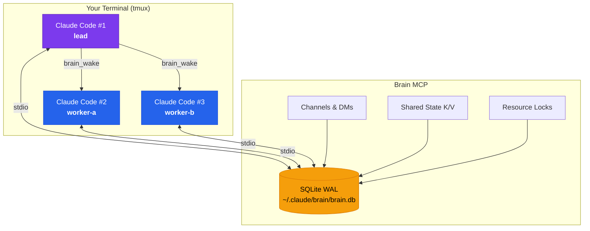
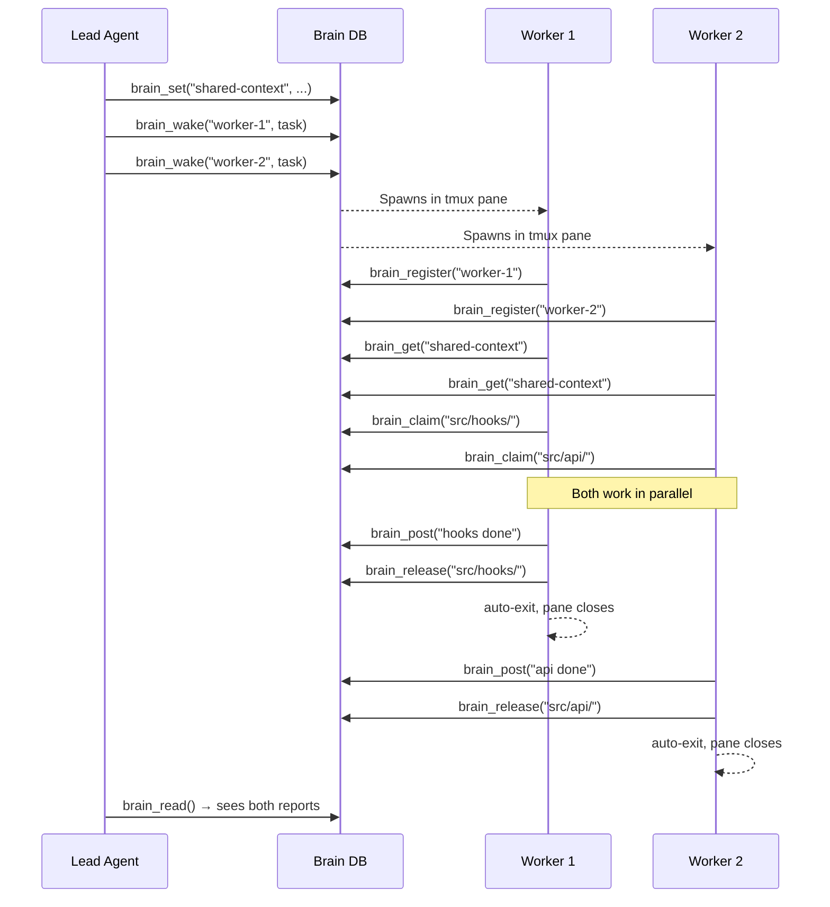

<div align="center">

<br>

# Brain MCP

**Multi-agent orchestration for Claude Code**

Give your AI agents a shared brain. Communicate, coordinate, and spawn<br>parallel agents — all through a single MCP server backed by SQLite.

<br>

[](https://www.npmjs.com/package/brain-mcp)
[](LICENSE)
[](https://nodejs.org)
[](https://modelcontextprotocol.io)
[](https://github.com/DevvGwardo/brain-mcp)

<br>

[Getting Started](#install) · [Tools](#tools) · [Agent Spawning](#agent-spawning) · [Architecture](#architecture) · [Examples](#examples)

<br>

</div>

---

## Install

**One command** — clone, build, and configure:

```bash
git clone https://github.com/DevvGwardo/brain-mcp.git ~/brain-mcp && cd ~/brain-mcp && npm install && npm run build && ./install.sh
```

The install script registers the brain MCP server via `claude mcp add`. Works in **every project** globally.

**Or install manually:**

```bash
claude mcp add brain -s user -- node ~/brain-mcp/dist/index.js
```

Verify it's connected:

```bash
claude mcp list | grep brain
# brain: node /Users/.../brain-mcp/dist/index.js - ✓ Connected
}
```

</details>
```

Restart Claude Code. Done.

---

## What is this?

Multiple Claude Code sessions can't talk to each other. They duplicate work, create merge conflicts, and have no way to coordinate.

**Brain MCP fixes this.** It gives every session access to a shared brain — messages, state, resource locks, and the ability to spawn new agents in split tmux panes.

```
"Add proper error handling with 3 agents"
```

That's all you need to say. Claude auto-splits the work, spawns parallel agents side by side, and coordinates through the brain.

---

## Architecture



Each Claude Code session spawns its own `brain-mcp` process via stdio. All processes share the same SQLite database (WAL mode for safe concurrent access). Sessions in the **same working directory** auto-group into a room. Zero server management required.

---

## Tools

### Identity & Discovery

| Tool | Description |
|:-----|:------------|
| `brain_register` | Set a display name for this session |
| `brain_sessions` | List all active sessions |
| `brain_status` | Show this session's info and room |

### Messaging

| Tool | Description |
|:-----|:------------|
| `brain_post` | Post a message to a channel (room-scoped) |
| `brain_read` | Read messages from a channel with polling support |
| `brain_dm` | Send a direct message to another session |
| `brain_inbox` | Read direct messages |

### Shared State

| Tool | Description |
|:-----|:------------|
| `brain_set` | Set a key-value pair in shared state |
| `brain_get` | Read a value from shared state |
| `brain_keys` | List all keys in a scope |
| `brain_delete` | Remove a key from shared state |

### Resource Coordination

| Tool | Description |
|:-----|:------------|
| `brain_claim` | Claim exclusive access to a resource (mutex) |
| `brain_release` | Release a claimed resource |
| `brain_claims` | List all active claims |

### Agent Spawning

| Tool | Description |
|:-----|:------------|
| `brain_wake` | Spawn a new Claude Code session in a tmux pane with a task |

`brain_wake` layout options:

| Layout | View | Best for |
|:-------|:-----|:---------|
| `horizontal` | Side by side (default) | 2 agents |
| `vertical` | Stacked top/bottom | 2 agents, full width |
| `tiled` | Auto-grid | 3+ agents |
| `window` | New tmux tab | Background work |

---

## Agent Spawning

One agent can spawn others with `brain_wake`. Spawned agents:

- Open in **visible tmux split panes** (side by side by default)
- Run with `--dangerously-skip-permissions` for unattended execution
- Use `claude -p` (print mode) so they **auto-exit when done** — panes close cleanly
- Read their task from the brain's `tasks` channel automatically



---

## Examples

### Simple — just talk naturally

```
"Refactor the API routes with 2 agents"
```

```
"Add loading states to all components, use 3 agents"
```

```
"Review this codebase in parallel"
```

> Add the [Brain orchestration instructions](https://github.com/DevvGwardo/brain-mcp#claude-code-instructions) to your `CLAUDE.md` and Claude will automatically use the brain tools when you mention parallel agents.

### Manual — step by step

**Session 1 — Architect**
```
brain_register("architect")
brain_set(key="api_contract", value='{"users": "GET /api/users"}')
brain_post(content="Contract is set. Frontend: take users. Backend: take posts.")
```

**Session 2 — Frontend**
```
brain_register("frontend")
brain_read()                              # sees architect's message
brain_get(key="api_contract")             # reads the contract
brain_claim("src/pages/Users.tsx")        # locks the file
brain_dm(to="backend", content="What shape is the /users response?")
```

**Session 3 — Backend**
```
brain_register("backend")
brain_inbox()                             # sees frontend's question
brain_claim("src/api/posts.ts", ttl=300)  # auto-releases in 5 min
brain_post(content="Users response: { id, name, email }[]")
```

---

## Claude Code Instructions

Add this to your project's `CLAUDE.md` so Claude automatically orchestrates when you say "with N agents":

```markdown
## Brain MCP — Multi-Agent Orchestration

The `brain` MCP server enables multiple Claude Code sessions to communicate
and coordinate. When the user asks to parallelize work, use multiple agents,
split a task, or swarm something, use the brain tools automatically.

### How to orchestrate
1. `brain_register` with a name describing your role
2. Analyze the task and decide how to split it across agents
3. Read relevant files to build shared context
4. `brain_set` the shared context so spawned agents can read it
5. `brain_wake` each agent with a clear task
6. Monitor with `brain_read` until all agents report back
7. Post a final summary

### Rules
- Each agent gets different files — never assign the same file to two agents
- Use `brain_claim` before editing, `brain_release` after
- For 3+ agents, pass `layout: "tiled"` to `brain_wake`
```

---

## Configuration

All configuration is through environment variables:

| Variable | Default | Description |
|:---------|:--------|:------------|
| `BRAIN_SESSION_NAME` | `session-{pid}` | Pre-set session name |
| `BRAIN_ROOM` | Working directory | Override automatic room grouping |
| `BRAIN_DB_PATH` | `~/.claude/brain/brain.db` | Custom database location |

```json
{
  "mcpServers": {
    "brain": {
      "command": "node",
      "args": ["~/brain-mcp/dist/index.js"],
      "env": {
        "BRAIN_SESSION_NAME": "worker-1",
        "BRAIN_ROOM": "my-project"
      }
    }
  }
}
```

---

## Brain vs Built-in Teams

| | Claude Code Teams | Brain MCP |
|:--|:--|:--|
| **Visibility** | Hidden background workers | Visible split panes |
| **Communication** | None between subagents | Channels, DMs, shared state |
| **File safety** | Can conflict | Mutex locking |
| **Persistence** | Dies with session | Survives restarts |
| **Spawning** | Parent only | Any agent can spawn more |
| **Independence** | Tied to parent context | Fully standalone sessions |

---

## Development

```bash
npm run dev     # Watch mode
npm run build   # Build
npm start       # Run directly
```

---

<div align="center">

<br>

Node.js 18+ &nbsp;&middot;&nbsp; Claude Code with MCP support &nbsp;&middot;&nbsp; tmux (for `brain_wake`)

[MIT License](LICENSE) &nbsp;&middot;&nbsp; Built for the [Model Context Protocol](https://modelcontextprotocol.io) ecosystem

<br>

</div>
