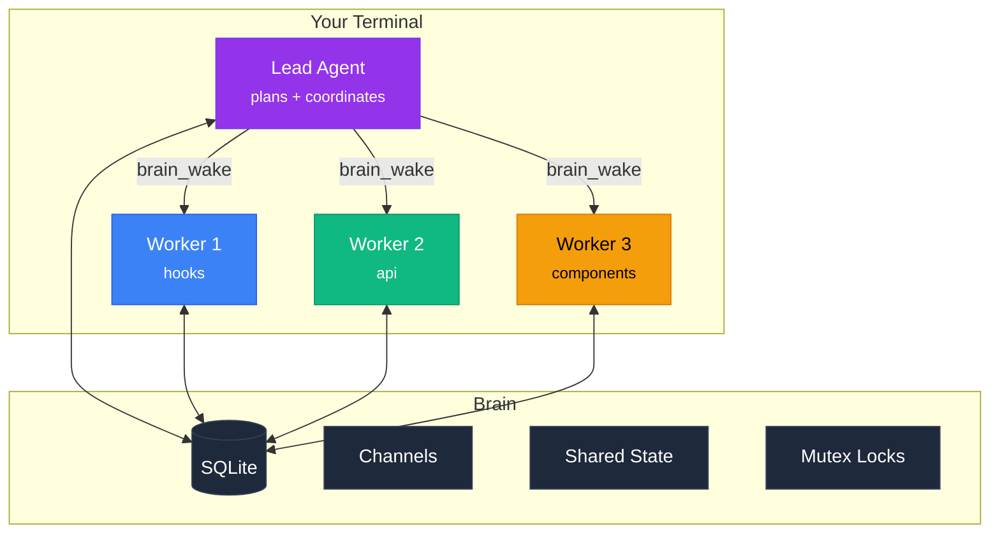
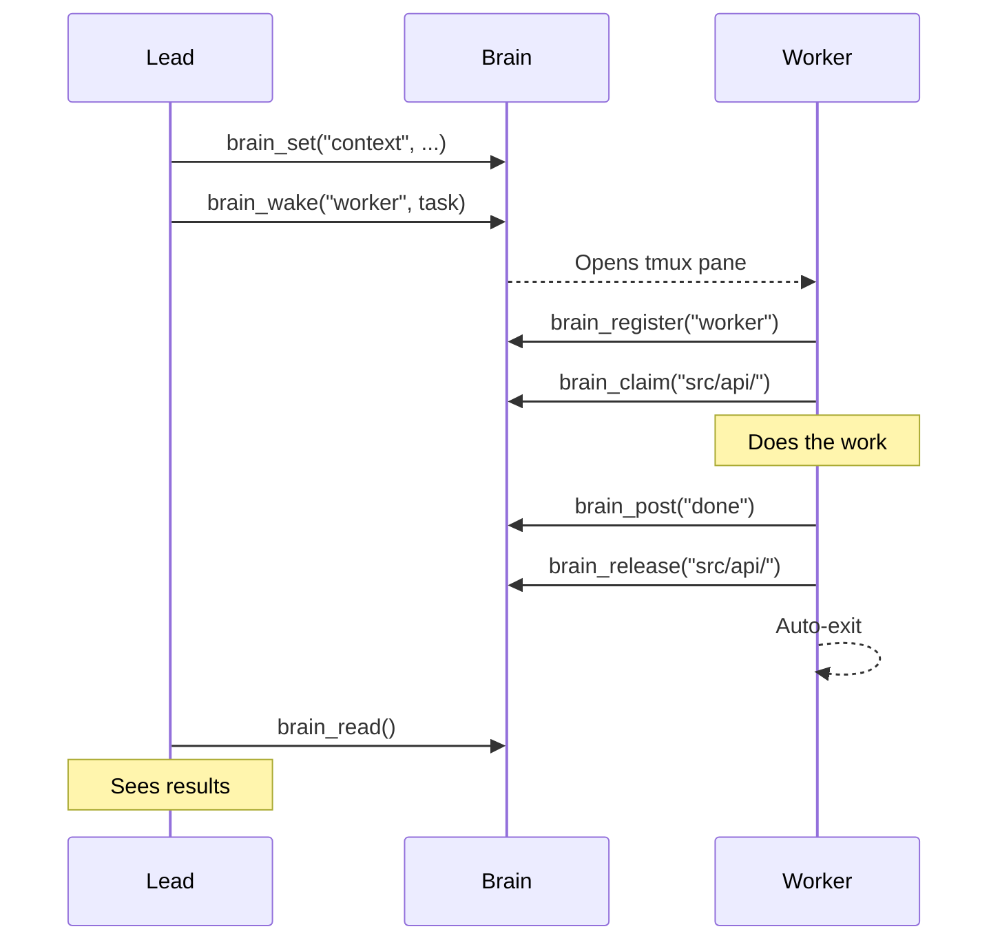
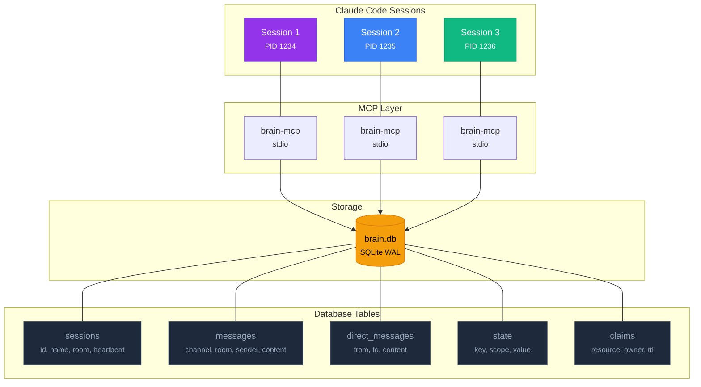
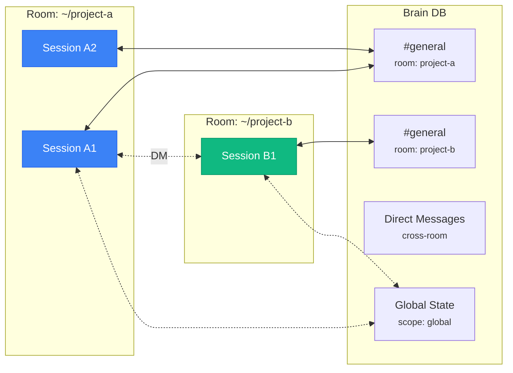
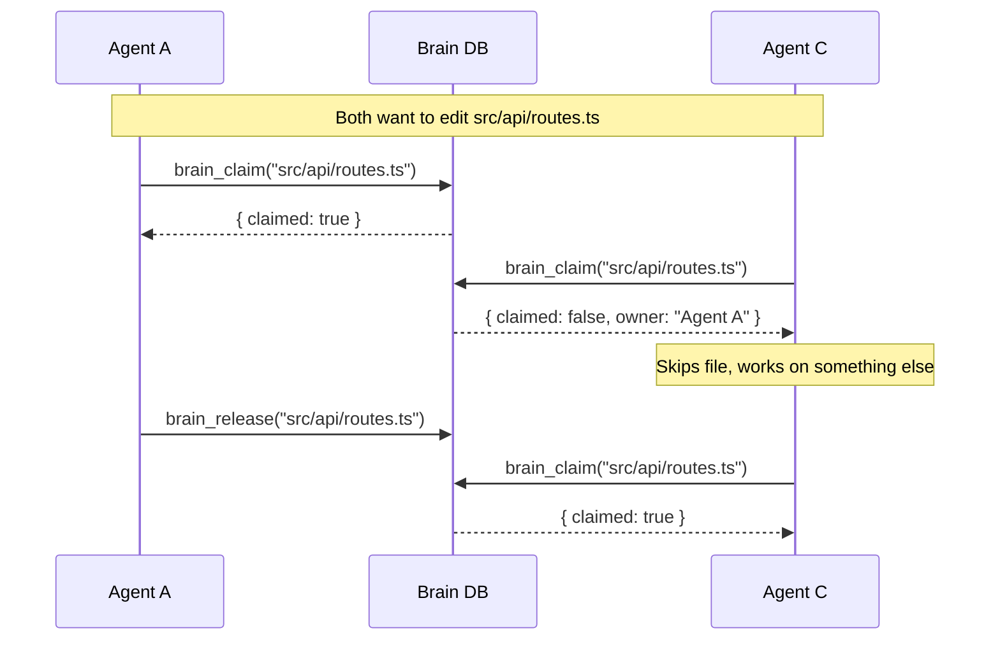
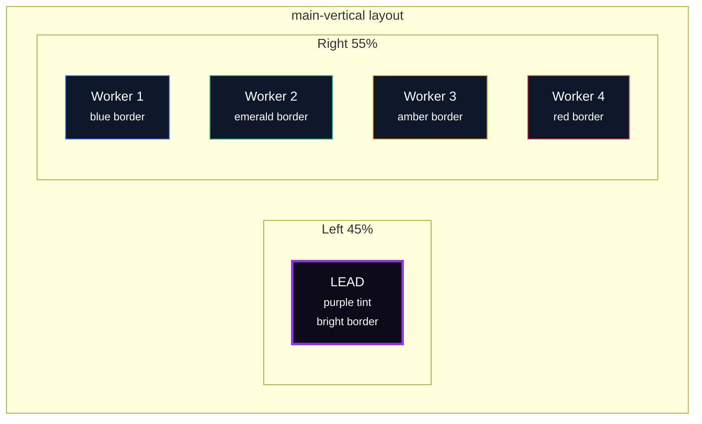
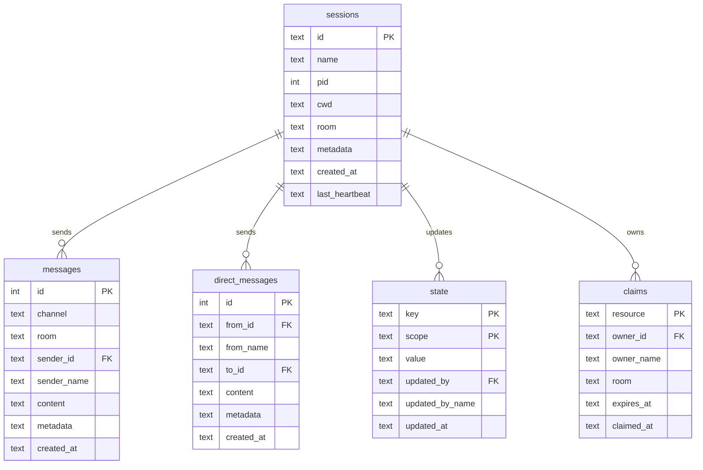

<div align="center">

<br>

# Brain MCP

**Multi-agent orchestration for Claude Code**

Give your AI agents a shared brain. Communicate, coordinate, and spawn<br>parallel agents — all through a single MCP server backed by SQLite.

<br>

[](LICENSE)
[](https://nodejs.org)
[](https://modelcontextprotocol.io)
[](https://github.com/DevvGwardo/brain-mcp)

<br>

[Install](#install) · [Quick Start](#quick-start) · [How It Works](#how-it-works) · [Tools](#tools) · [Advanced](#advanced)

<br>

</div>

---

## Install

```bash
git clone https://github.com/DevvGwardo/brain-mcp.git ~/brain-mcp \
  && cd ~/brain-mcp \
  && npm install \
  && npm run build \
  && ./install.sh
```

**Or manually:**

```bash
claude mcp add brain -s user -- node ~/brain-mcp/dist/index.js
```

**Verify:**

```bash
claude mcp list | grep brain
# brain: node .../brain-mcp/dist/index.js - ✓ Connected
```

Restart Claude Code. Done.

---

## Quick Start

Open any project in Claude Code and say:

```
Refactor the API routes with 3 agents
```

That's it. Claude registers as lead, splits the work, spawns 3 agents in tmux panes, and coordinates through the brain.

**More examples:**

```
Add error handling to the whole codebase with 4 agents
```
```
Review this project in parallel with 2 agents
```
```
Use brain_wake to spawn 6 agents that each improve a different module
```

---

## How It Works



Each Claude Code session spawns its own `brain-mcp` process via stdio. All processes share the same SQLite database with WAL mode for safe concurrent access. Sessions in the same directory auto-group into a room.

**No server to manage. No config per project. Just install once and use everywhere.**

---

## Tools

16 tools across 6 categories.

### Identity

| Tool | What it does |
|:-----|:-------------|
| `brain_register` | Name this session |
| `brain_sessions` | List active sessions |
| `brain_status` | Show session info + room |

### Messaging

| Tool | What it does |
|:-----|:-------------|
| `brain_post` | Post to a channel |
| `brain_read` | Read from a channel |
| `brain_dm` | Direct message another session |
| `brain_inbox` | Read your DMs |

### Shared State

| Tool | What it does |
|:-----|:-------------|
| `brain_set` | Store a key-value pair |
| `brain_get` | Read a value |
| `brain_keys` | List all keys |
| `brain_delete` | Remove a key |

### Coordination

| Tool | What it does |
|:-----|:-------------|
| `brain_claim` | Lock a resource (mutex) |
| `brain_release` | Unlock a resource |
| `brain_claims` | List all locks |

### Orchestration

| Tool | What it does |
|:-----|:-------------|
| `brain_wake` | Spawn a new Claude Code session in tmux |
| `brain_clear` | Reset all brain data |

---

## Agent Spawning

`brain_wake` opens a real interactive Claude Code session in a tmux split pane:



**Layout options:**

| Layout | View | Best for |
|:-------|:-----|:---------|
| `horizontal` | Side by side (default) | 2 agents |
| `vertical` | Top / bottom | Full width |
| `tiled` | Auto-grid | 3+ agents |
| `window` | New tmux tab | Background |

**The lead pane** gets a purple tint and sits on the left at 45% width. Worker panes stack on the right, each with a unique colored border (blue, emerald, amber, red, violet, pink, cyan, orange, teal, purple).

---

## Brain vs Built-in Teams

| | Claude Code Teams | Brain MCP |
|:--|:--|:--|
| **Visibility** | Hidden | Visible split panes |
| **Communication** | None between agents | Channels, DMs, state |
| **File safety** | Can conflict | Mutex locking |
| **Persistence** | Dies with session | Survives restarts |
| **Spawning** | Parent only | Any agent can spawn more |
| **Independence** | Shared context | Fully standalone |

---

# Advanced

Everything below covers the full technical depth of Brain MCP.

---

## Architecture Deep Dive



**Key design decisions:**

- **One process per session**: Each Claude Code session spawns its own `brain-mcp` process. No shared long-running server.
- **SQLite WAL mode**: Multiple processes can read simultaneously. Writes are serialized with a 5-second busy timeout.
- **Heartbeat cleanup**: Sessions that haven't pinged in 5 minutes are considered dead and excluded from listings.
- **Room scoping**: The working directory is the default room. Sessions in the same directory see each other's messages and state.

---

## Scoping Model



| Scope | How it works |
|:------|:-------------|
| **Room** | Sessions in the same `cwd` share channels and state by default |
| **Channels** | Named streams within a room (e.g. `general`, `tasks`) |
| **DMs** | Cross-room direct messages between any two sessions |
| **Global state** | Use `scope: "global"` in `brain_set`/`brain_get` for cross-room data |

---

## Spawned Agent Lifecycle

```mermaid
stateDiagram-v2
    [*] --> Spawning: brain_wake called

    Spawning --> Initializing: tmux pane created
    Initializing --> WaitingForReady: Claude Code loading

    state "Ready Detection" as Ready {
        WaitingForReady --> CheckPane: poll every 2s
        CheckPane --> PromptDetected: status bar text found
        CheckPane --> WaitingForReady: not ready yet
        CheckPane --> FallbackWait: 60 attempts
        FallbackWait --> PromptDetected: 15s flat sleep
    }

    PromptDetected --> PromptPasted: tmux paste-buffer
    PromptPasted --> Working: Agent executes task

    state "Working" as Working {
        [*] --> ReadingBrain: brain_get context
        ReadingBrain --> ClaimingFiles: brain_claim
        ClaimingFiles --> Editing: make changes
        Editing --> ReleasingFiles: brain_release
        ReleasingFiles --> PostingResults: brain_post
    }

    Working --> Idle: Task complete

    state "Auto-Exit Detection" as AutoExit {
        Idle --> HashCheck: content hash every 5s
        HashCheck --> StableCount: hash unchanged
        StableCount --> HashCheck: count < 3
        StableCount --> SendExit: 3 consecutive (15s stable)
    }

    SendExit --> ExitSent: /exit sent to pane
    ExitSent --> PaneClosed: Claude exits
    PaneClosed --> ForceKill: still alive after 5s
    ExitSent --> [*]: pane closed
    ForceKill --> [*]: tmux kill-pane
```



**Three phases:**

1. **Ready detection** — Polls the tmux pane every 2 seconds looking for Claude Code's status bar. Falls back to a 15-second flat wait.
2. **Prompt injection** — Uses `tmux load-buffer` + `tmux paste-buffer` to send the task prompt to the interactive session.
3. **Auto-exit** — Hashes pane content every 5 seconds. When unchanged for 15 seconds (3 checks), sends `/exit`. Force-kills if still alive after 5 more seconds.

---

## Conflict Prevention



**Two layers of protection:**

1. **Planning layer** — The lead agent assigns non-overlapping files to each worker
2. **Runtime layer** — `brain_claim` is an atomic mutex. The second claimer gets `{ claimed: false, owner: "..." }` and must skip or wait

**TTL safety net**: `brain_claim("file", ttl=300)` auto-releases after 5 minutes, preventing zombie locks from crashed agents.

---

## Tmux Layout Engine



**10 agent colors** (cycling): blue, emerald, amber, red, violet, pink, cyan, orange, teal, purple

**Layout auto-selection:**
- Default: `main-vertical` — lead on left, workers stacked right
- `tiled`: even grid for 3+ agents
- `horizontal` / `vertical`: simple 2-pane splits
- `window`: separate tmux tab

---

## Database Schema



**Database location**: `~/.claude/brain/brain.db`

**Indexes**: channel+room+id on messages, to_id+id on DMs, room on sessions

---

## Configuration Reference

| Variable | Default | Description |
|:---------|:--------|:------------|
| `BRAIN_SESSION_NAME` | `session-{pid}` | Pre-set session name |
| `BRAIN_ROOM` | Working directory | Override room grouping |
| `BRAIN_DB_PATH` | `~/.claude/brain/brain.db` | Custom database path |

---

## CLAUDE.md Integration

Add to your project's `CLAUDE.md` for automatic orchestration:

```markdown
## Brain MCP

When the user asks for parallel agents, multi-agent work, or swarm:
1. brain_register as "lead"
2. Split work across agents with non-overlapping files
3. brain_set shared context
4. brain_wake each agent
5. Monitor with brain_read
6. brain_claim before editing, brain_release after
```

---

## Companion: Brain Swarm

[Brain Swarm](https://github.com/DevvGwardo/brain-swarm) adds predefined team templates on top of Brain MCP:

```
Swarm this codebase with the dev team
```

Spawns a 6-agent pipeline: planner, backend-dev, frontend-dev, tester, reviewer, deployer.

---

## Development

```bash
npm run dev     # Watch mode
npm run build   # Compile
npm start       # Run server
```

---

<div align="center">

<br>

Node.js 18+ &nbsp;&middot;&nbsp; Claude Code &nbsp;&middot;&nbsp; tmux &nbsp;&middot;&nbsp; [MCP Protocol](https://modelcontextprotocol.io)

[MIT License](LICENSE)

<br>

</div>
